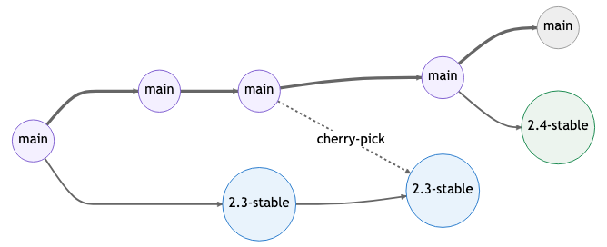

# GitLab Flow

- [GitLab Flow](#gitlab-flow)
    - [Overview](#overview)
    - [Keep branch strategy simple](#keep-branch-strategy-simple)
    - [Branch Types in GitLab Flow](#branch-types-in-gitlab-flow)
    - [Continuous Deployment Environments](#continuous-deployment-environments)
    - [GitLab CI/CD Workflow Steps](#gitlab-cicd-workflow-steps)
      - [Example `.gitlab-ci.yml` Configuration:](#example-gitlab-ciyml-configuration)
    - [Handling Bugfixes and Hotfixes during different phases](#handling-bugfixes-and-hotfixes-during-different-phases)
      - [Development Phase](#development-phase)
      - [Staging/Pre-Production Phase](#stagingpre-production-phase)
      - [After Release in Production](#after-release-in-production)
    - [General Practices](#general-practices)
    - [Sources](#sources)

<br/>

### Overview
GitLab Flow is a workflow that incorporates aspects of both Git flow and GitHub flow and is adapted for continuous deployment. This workflow combines [feature-driven development](https://en.wikipedia.org/wiki/Feature-driven_development) and [feature branches](https://martinfowler.com/bliki/FeatureBranch.html) with issue tracking. Here’s how it works:

<br/>

### Keep branch strategy simple
Keep our branch strategy simple. We Build a strategy from these three concepts:

- Use feature branches for all new features and bug fixes.
- Merge feature branches into the main branch using pull requests.
- Keep a high quality, up-to-date main branch.

A strategy that extends these concepts and avoids contradictions will result in a version control workflow for your team that is consistent and easy to follow.

<br/>

### Branch Types in GitLab Flow
**Main Branch**:
- **Description:** This is the main branch where all the development comes together. your **`main`** branch remains a reliable "**source of truth**".
- **Naming Convention:** `main`
- **Purpose:** This branch always contains production-ready code. We also call it as integration branch that contains the latest completed features, improvements, and bug fixes..

**Feature Branches:**
- **Description:** Used for developing new features or improvements separate from the main codebase.
- **Naming Convention:** `feature/<feature-description>`
- **Purpose:** These are branches created from the main branch for the development of each new feature. Once the feature is complete and tested, it is merged back into main. The branch is then typically deleted to keep things tidy. You create a pull request or merge request in the GitLab. This is a proposal to merge your feature branch into the main branch.

**Bugfix Branches:**
- **Description:** For fixing bugs found in the main branch or in production.
- **Naming Convention:** `bugfix/<bug-description>`
- **Purpose:** These are branches created for fixing bugs.

**Release Branches:**
- **Description:** These branches are created for preparing releases. They might contain additional metadata or versioning information and are based on the main branch.
- **Naming Convention:** `release/<version>`, for example, release/v1.2.3.
- **Purpose:** Facilitate final preparations for a release like testing, documentation, and final tweaks. each release has an associated release branch that is based off the main branch. After announcing a release branch, only add serious bug fixes to the branch. If possible, first merge these bug fixes into main, and then cherry-pick them into the release branch 

**Hotfix Branches:**
- **Description:** For urgent and critical fixes that need to be deployed to production immediately.
- **Naming Convention:** `hotfix/<hotfix-description>`
- **Purpose:** Quickly patch and deploy fixes for critical issues in production. After deployment, hotfixes are merged back into the main branch, and changes should be propagated to any active release or feature branches to ensure the fixes are integrated into all current and future work.


<br/>
<p align="center">
  
  <p align="center">working with new features</p>
</p>
<br/>

<br/>
<p align="center">
  
  <p align="center">Release branches with GitLab Flow</p>
</p>
<br/>

### Continuous Deployment Environments
How we use different environments in conjunction with our branching strategy:

1. **Development Environment:**

- **Branches Used:** Feature branches and bugfix branches.
- **Purpose**: This is where developers initially build and test their features or bug fixes. It's essentially their local or individual development setup.
- **Workflow:** Developers work on their tasks within these branches. This environment is more about the developer's local setup (their own machine) where they can run and test their code in isolation before it gets merged anywhere.

1. **Continuous Deployment to Testing Environment:**

- **Trigger:** Merges to the main branch.
- **Purpose:** The testing environment is continuously updated with the latest 'production-ready' code from the main branch. This is where QA or automated tests are run to ensure the stability of the code before it's released.
- **Workflow:** Once features/bugfixes are merged into the main branch, they are automatically deployed to this environment.

3. **Staging Environment (Triggered by Release Branch):**

- **Trigger:** Creation of a release branch.
- **Purpose:** A pre-production environment that closely mimics the production setup. This is where final testing and client or stakeholder reviews happen.
- **Workflow:** After a set of features and fixes in the main branch is deemed ready for release, a release branch is created, which triggers deployment to staging. Once validated, this branch is then deployed to production.

4. **Feature Environment (Optional):**

- **Trigger:** Manual deployment of specific feature branches.
- **Purpose:** Sometimes, for large features or for features requiring special attention, it's beneficial to have an isolated environment for testing them.
- **Workflow:** Not every feature branch is deployed here, only those that require extensive isolated testing or review by stakeholders. This deployment is usually done manually or via a specific trigger other than just creating a feature branch.

<br/>

the "development environment" is essentially the local setup of each developer. They work on their feature/bugfix branches, and once their work is ready and peer-reviewed, it gets merged into the main branch, triggering deployment to the testing environment. This setup ensures that your main branch remains stable and is always in a deployable state, which is a key principle of continuous deployment.

This approach minimizes the risk of unstable code reaching the testing or staging environments and maintains a clear pathway from development to production.

<br/>

### GitLab CI/CD Workflow Steps
Here’s a simplified version of the GitLab Flow, which includes the use of feature branches, testing, staging and the production environment:

<br/>
<p align="center">
  
  <p align="center">Gitlab CI/CD workflow</p>
</p>
<br/>

1. **Main Branch**:
    - `main` represents the production-ready state of your code.
2. **Feature Branches**:
    - For new features, you create a branch from `main`, e.g., `feature/add-login`.
    - Work is done on the feature branch and tested locally.
3. **Merge Requests (MR)**:
    - Once the feature is complete, you create a **Merge Request (MR)** to merge `feature/add-login` into `main`.
    - Each MR is reviewed and, upon approval, merged into **`main`**.
4. **Continuous Integration**:
    - Every merge into **`main`** triggers the CI pipeline which runs automated tests to ensure that the integration does not break the existing build..
5. **Deployment to Testing**:
    - If the CI pipeline passes, The `main` branch is automatically deployed to a testing environment for further testing.
6. **Staging/Pre-production to Production**:
    - When you decide it's time for a release (by accumulating features), create a `release/v1.0.0` branch from main. CI/CD pipeline is configured so that any push to a  release/ branch will deploy to your staging or pre-production environment. Extensive testing and any pre-release activities happen in this staging environment.
    - Extensive testing and any pre-release activities happen in this environment.
    - This branch should trigger a deployment to a staging or pre-production environment. 
    - The code on this branch should not include new features after this point—only bug fixes, performance improvements, or other necessary updates.
    - Production deployment happens only on approval. We need a manual action from a user to trigger the deployment to production environment.

#### Example `.gitlab-ci.yml` Configuration:

example of **[gitlab-ci.yml](.gitlab-ci.example.yml)** file

In this `.gitlab-ci.yml`:

- `test` runs automated tests for merge requests, feature/bugfix branches.
- `deploy_testing` if previous job passes, deploys the `main` branch to a testing environment after the merge is complete.
- `deploy_staging` if previous job passes, deploys the `release` branch to a staging environment after the merge is complete.
- `deploy_production` is a manual job that deploys a `release` branch to the production environment.

This flow ensures that all new features are reviewed and tested before they are deployed to production. The usage of environments and tagging (release) helps manage releases in an orderly fashion, and bugfixes can be handled expediently when needed.

Remember to protect the `release/*` branches so that only certain users can push to them and trigger deployments.

<br/>

### Handling Bugfixes and Hotfixes during different phases
Handling bugfixes and hotfixes in a continuous deployment environment like GitLab Flow can vary depending on the stage of development. Here's a structured approach to handling both during different phases:

#### Development Phase
- **Bugfixes**: When bugs are discovered during development, create an issue in your tracking system.

  ```sh
  # Create Bugfix Branch: Create a new branch from main for the bugfix.
  git checkout main
  git checkout -b bugfix/issue-description

  # Fix the bug
  git commit -am "Fix bug in main"
  git push origin bugfix/some-bug
  # Create a merge/pull request to main
  ```

#### Staging/Pre-Production Phase
- **Bugfixes**: After a release branch is created, any bugs identified in staging should be fixed in a bugfix branch forked from the release branch. After the fix, the bugfix branch is merged back into the release branch and main

  ```sh
  # Checkout the release branch
  git checkout release/v1.2.3
  # Create a bugfix branch
  git checkout -b bugfix/some-bug-release
  # Fix the bug and commit changes
  git commit -am "Fix bug for release v1.2.3"
  git push origin bugfix/some-bug-release
  # create new release
  git checkout -b release/v1.2.4 release/v1.2.3
  git merge hotfix/v1.2.3-fix-description
  git push origin release/v1.2.4
  # back merge to main
  git checkout main
  git merge bugfix/some-bug-release
  git push origin main
  ```

#### After Release in Production
- **Hotfixes**: When critical issues are found in production, hotfix branches are used to provide a quick resolution.

  ```sh
  git checkout release/v1.2.3
  git checkout -b hotfix/v1.2.3-fix-description
  # Apply the fix and commit changes
  git commit -am "Apply urgent hotfix for v1.2.3"
  git push --set-upstream origin hotfix/some-critical-issue-release
  # create new release
  git checkout -b release/v1.2.4 release/v1.2.3
  git merge hotfix/v1.2.3-fix-description
  git push origin release/v1.2.4
  # back merge to main
  git checkout main
  git merge hotfix/v1.2.3-fix-description
  git push origin main
  ```


<br />

### General Practices
- **Merge Requests (MRs)/Pull Requests (PRs)**: All changes should be made through MRs/PRs with code review and automated tests to maintain code quality.
- **Tagging Releases**: Always tag releases and hotfixes with semantic versioning to keep track of changes.
- **Communication**: Keep all team members informed about the bug and hotfix status through your issue tracking system.
-  If there were any changes made in the release branch during staging testing (like configuration changes or any fixes), merge those back into main to ensure main reflects what's in production and any other active development branches to ensure that the fixes are integrated into the ongoing development work.

Following this process ensures that bugfixes and hotfixes are handled efficiently and safely, minimizing disruption to ongoing development and to users in production.


---
### Sources

[4 branching workflows for Git](https://medium.com/@patrickporto/4-branching-workflows-for-git-30d0aaee7bf)
[Adpopt a Git branching strategy by Azure DevOps](https://learn.microsoft.com/en-us/azure/devops/repos/git/git-branching-guidance?view=azure-devops)